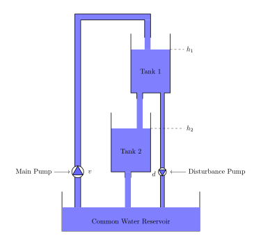
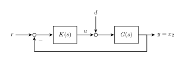
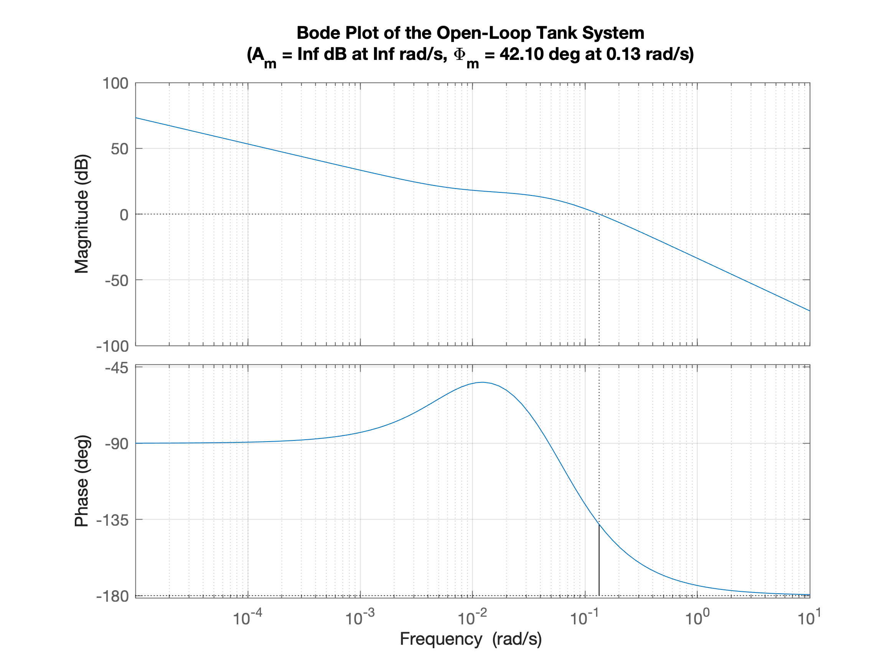
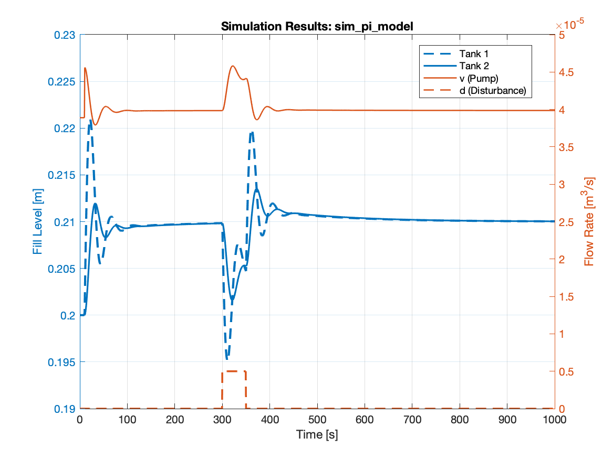

# 2-Tank System: Simulation & Control

This project implements a numerical simulation and control design for a non-linear, coupled two-tank system using MATLAB and Simulink. The goal is to regulate the liquid level in the second tank despite external disturbances.

## System Dynamics

The system consists of two cylindrical tanks connected in series. Water is pumped from a common reservoir into Tank 1, which then flows into Tank 2.

### Physical Model

The system is described by the following non-linear differential equations based on the principle of mass balance and Torricelli's law:

$$A_1 \dot{h}_1 = v - a_{1} \mu \sqrt{2g h_1} - d$$
$$A_2 \dot{h}_2 = a_{1} \mu \sqrt{2g h_1} - a_{2} \mu \sqrt{2g h_2}$$

Where:

* $h_i$ is the liquid level in tank $i$.
* $A_i$ is the cross-sectional area of tank $i$.
* $v$ is the volumetric inflow from the main pump.
* $d$ is the disturbance flow (simulated as a constant outflow via a second pump).
* $\mu$ is the discharge coefficient.

### Specifications

* **Limits**: Maximum allowed tank height is 30cm to prevent overflow.
* **Actuator Saturation**: To reflect real-world process engineering, the pump is limited to $2 \cdot v_{\text{bar}}$. This assumes the operating point sits at 50% of the maximum capacity.
* **Disturbance**: A secondary pump constanty extracts water from Tank 1, testing the controller's robustness.

## Control Design

### Linearization & Control Strategy

To design the PI controller, the non-linear system is linearized around a steady-state operating point (Equilibrium).

#### Operating Point (Equilibrium)

The equilibrium $(\bar{h}_1, \bar{h}_2)$ is defined by a chosen setpoint $\bar{h}_2$. At this point, the change in levels is zero ($\dot{h}_1 = 0, \dot{h}_2 = 0$):

* $\bar{v} = a_1 \mu \sqrt{2g \bar{h}_1}$
* $a_1 \mu \sqrt{2g \bar{h}_1} = a_2 \mu \sqrt{2g \bar{h}_2} \iff \bar{h}_1 = \frac{a_2^2}{a_1^2}\bar{h}_2$

#### Error Coordinates

For the controller design, we shift the system into error coordinates (deviation variables). This allows the controller to operate on the difference between the current state and the equilibrium:

* $\Delta h_1 = h_1 - \bar{h}_1$
* $\Delta h_2 = h_2 - \bar{h}_2$
* $\Delta v = v - \bar{v}$

The controller's task is to drive the error $\Delta h_2$ to zero.

> **Mathematical Detail**: For the full step-by-step derivation of the linearized state-space representation and the determination of the Jacobi matrices, please refer to the [Detailed Mathematical Derivation](data/for_readme/derivation_of_equations.pdf).

### PI Controller

First, we evaluate the performance of a standard PI controller to establish a baseline for the system's regulation capabilities. The design follows the Loopshaping principle:

* **Proportional Action ($K_p$)**: The gain is tuned to maximize the crossover frequency ($\omega_c$) while maintaining a sufficient phase margin ($\Phi_m \approx 40^\circ$). Increasing $K_p$ improves response speed but reduces the stability margin.
* **Integral Action ($K_i$)**: An integral term is required to eliminate steady-state error, which is inherent in the open-loop tank dynamics. The reset time is tuned to provide fast setpoint tracking; however, excessive integral gain leads to significant overshoot and increased settling time.

#### Learnings

* **Proportional Gain ($K_p$) & Stability**: Increasing $K_p$ improves responsiveness but leads to significant overshoot. Excessive values, especially in combination with integral action, drive the non-linear system into instability or high-frequency oscillations.
* **Integral Action ($K_i$) & Steady-State Error**: An Integral component is mandatory to eliminate steady-state control deviation. Without it, the system exhibits a permanent offset because the open-loop transfer function $G(j\omega)$ converges to a finite value as $\omega \to 0$.
* **System Dynamics & Delay**: Even with optimized controller parameters, the system's response to setpoint changes and disturbances remains slow. This is due to the physical coupling of the tanks: the control input only affects Tank 1 directly, creating a "propagation delay" before influencing the level in Tank 2.
* **Disturbance Rejection**: The PI controller effectively compensates for external disturbances (e.g., constant outflow), but the recovery speed is constrained by the same physical time constants as the setpoint tracking.

### Cascaded Control using PI

#### Motivation for Cascade Control

While the single-loop PI controller provides basic stability and performance, it reveals two significant drawbacks in our dual-tank system:

* **Delayed Disturbance Rejection**: A disturbance in the first tank (e.g., inflow changes) must propagate through the entire system dynamics before being detected by the $h_2$ sensor. This results in slow reaction times and large deviations.
* **Non-linear Coupling**: Tuning a single controller to handle the dynamics of both tanks simultaneously often leads to a compromise between sluggish tracking and excessive overshoot.

#### The Cascade Architecture

To overcome these limitations, we implement a Cascade Control structure, consisting of two nested loops:

1. **Inner Loop**: Controls the level of the first tank ($h_1$). It shall react immediately to disturbances and ensuring that the desired level $h_{1,des}$ is maintained.
2. **Outer Loop**: Controls the final level ($h_2$). It calculates the necessary $h_{1,des}$ to reach the target $h_2$ setpoint.

To design the cascade, we follow a bottom-up approach, starting with the inner controller.

#### Tuning the controller

**Design Procedure:**

* **Isolation**: The outer loop is deactivated (opened) to tune the inner controller purely on the dynamics of Tank 1.
* **P-only vs. PI Control**: For the inner loop, a proportional (P) controller is often sufficient and preferred.
  * Why no I-action? Steady-state accuracy for $h_1$ is not the primary goal; the outer controller will eventually compensate for any remaining offset. Adding an integrator in the inner loop would introduce additional phase lag, which limits the achievable speed and increases the risk of oscillations.
* **Bandwidth Requirements**: The crossover frequency ($\omega_{c,inner}$) is chosen to be as high as possible. As a rule of thumb, the inner loop should be at least 5 to 10 times faster than the planned outer loop. This ensures that the outer loop "sees" the inner loop as a near-perfect actuator with a gain of 1.
* **Constraints on the Proportional Gain ($K_{p1}$)**: While a first-order tank system is theoretically stable for any $K_p > 0$, the practical choice of $K_{p1}$ is limited by several factors: Numerical Stability, Actuator Saturation, Noise Sensitivity.

Once the inner loop is tuned and its performance is verified, we treat the entire inner closed-loop system as a single component of the "effective" outer plant. This decoupling is the core strength of the cascade architecture.

To shape the outer loop, we first define the **inner closed-loop transfer function** ($G_{inner,cl}$):

$$G_{inner,cl}(s) = \frac{K_1 \cdot G_{11}(s)}{1 + K_1 \cdot G_{11}(s)}$$

The effective plant for the outer controller ($G_{outer}$) then consists of this inner loop in series with the second tank's dynamics ($G_{21}$):

$$G_{outer}(s) = G_{inner,cl}(s) \cdot G_{21}(s)$$

The final open-loop transfer function used for the design of the primary controller $K_2$ is:

$$L_{out}(s) = G_{outer}(s) \cdot K_2(s)$$

* **Controller Selection**: We implement a PI controller for $K_2$. The integral action is non-negotiable here, as it ensures zero steady-state error for the target level $h_2$.
* **Frequency Separation**: A key design constraint is the separation of time scales. We tune $K_2$ such that the crossover frequency of $L_{out}$ is significantly lower (typically by a factor of 5-10) than that of the inner loop. This prevents the two controllers from "fighting" each other or causing resonance
* **Phase Margin**: Since the inner loop has already compensated for much of the phase lag associated with the first tank, we can typically achieve a robust phase margin ($\Phi_m \approx 60^\circ$) for the outer loop quite easily.

#### Learnings

* **Systematic Scaling and Normalization:** The chosen units have a massive impact on controller design. While SI units (meters and cubic meters per second) provide physical consistency, they introduce a significant **scaling discrepancy** in the control loop.
  * The Scaling Problem: In this specific tank system, a flow rate of $1 \, \text{m}^3/\text{s}$ is physically massive compared to a target level of $0.2 \, \text{m}$. This results in a plant gain ($G_p$) of approximately **80 dB** (a factor of 10,000). System-theoretically, this forces the controller gains ($K_p$) to be extremely small ($< 10^{-3}$) to maintain stability and phase margin. However, such small gains translate physically relevant errors (e.g., 1 cm) into control signals so minute ($10^{-7} \, \text{m}^3/\text{s}$) that they fail to effectively drive the system dynamics or overcome the inertia of the process.
  * The Solution: Normalization (Per-Unit Approach). To ensure a robust and intuitive controller design, a **Normalization Shell** was implemented around the control logic.

## Project Structure
